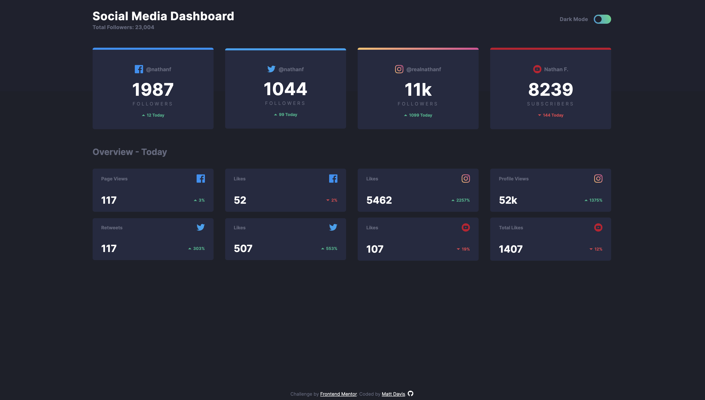

# 04 - Frontend Mentor - Social Media Dashboard w/Theme Switcher

This is a solution to the [Social media dashboard with theme switcher challenge on Frontend Mentor](https://www.frontendmentor.io/challenges/social-media-dashboard-with-theme-switcher-6oY8ozp_H). Frontend Mentor challenges help you improve your coding skills by building realistic projects.

### The challenge

Users should be able to:

- View the optimal layout for the app depending on their device's screen size
- See hover states for all interactive elements on the page
- Calculate the correct tip and total cost of the bill per person

### Screenshot of my solution

### Links

- GitHub URL: [04. social media dashboard](https://github.com/mattdavis06/Frontend-Mentor-Projects/tree/main/04.%20social-media-dashboard)
- Live Site URL: [//04-social-media-dashboard.netlify.app/](https://04-social-media-dashboard.netlify.app/)

### Built with

- Semantic HTML5 markup
- CSS custom properties
- Flexbox
- Mobile-first workflow
- Vanilla JavaScript
- Font Awesome

## Author

- Website - [mdavis.dev](https://www.mdavis.dev)
- Frontend Mentor - [@mattdavis06](https://www.frontendmentor.io/profile/mattdavis06)
