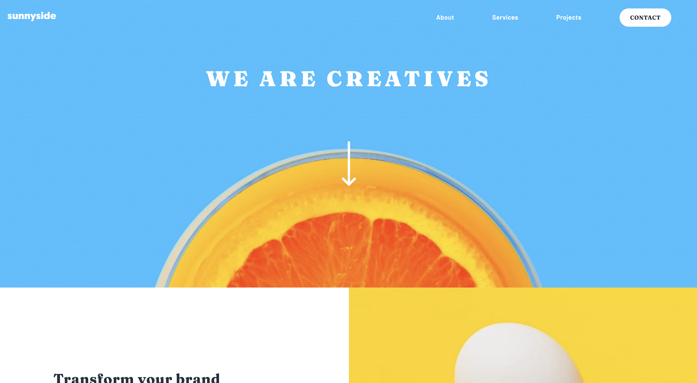

# 05 - Frontend Mentor - Sunnyside Agency Landing Page

This is a solution to the [Sunnyside agency landing page challenge on Frontend Mentor](https://www.frontendmentor.io/challenges/sunnyside-agency-landing-page-7yVs3B6ef). Frontend Mentor challenges help you improve your coding skills by building realistic projects.

### The challenge

Users should be able to:

- View the optimal layout for the app depending on their device's screen size
- See hover states for all interactive elements on the page
- Calculate the correct tip and total cost of the bill per person

### Screenshot of my solution

### Links

- GitHub URL: [05. sunnyside-agency-landing-page](https://github.com/mattdavis06/Frontend-Mentor-Projects/tree/main/05.%20sunnyside-agency-landing-page)
- Live Site URL: [//05-sunnyside-agency-landing-page.netlify.app/](https://05-sunnyside-agency-landing-page.netlify.app/)

### Built with

- Semantic HTML5 markup
- CSS custom properties
- Flexbox
- Mobile-first workflow
- Vanilla JavaScript
- Font Awesome

## Author

- Website - [mdavis.dev](https://www.mdavis.dev)
- Frontend Mentor - [@mattdavis06](https://www.frontendmentor.io/profile/mattdavis06)
