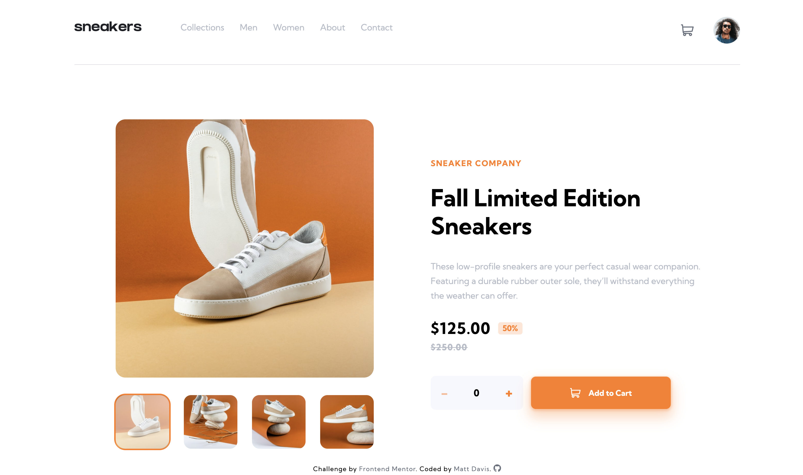

# 10 - Frontend Mentor - E-commerce Product Page

This is a solution to the [E-commerce product page challenge on Frontend Mentor](https://www.frontendmentor.io/challenges/ecommerce-product-page-UPsZ9MJp6). Frontend Mentor challenges help you improve your coding skills by building realistic projects.

### The challenge

Users should be able to:

- View the optimal layout for the site depending on their device's screen size
- See hover states for all interactive elements on the page
- Open a lightbox gallery by clicking on the large product image
- Switch the large product image by clicking on the small thumbnail images
- Add items to the cart
- View the cart and remove items from it

### Screenshot of my solution

### Links

- GitHub URL: [10. ecommerce-product-page](https://github.com/mattdavis06/Frontend-Mentor-Projects/tree/main/10.%20ecommerce-product-page)
- Live Site URL: [//10-ecommerce-product-page.netlify.app/](https://10-ecommerce-product-page.netlify.app/)

### Built with

- Semantic HTML5 markup
- CSS custom properties
- Flexbox
- Mobile-first workflow
- Vanilla JavaScript
- Font Awesome

## Author

- Website - [mdavis.dev](https://www.mdavis.dev)
- Frontend Mentor - [@mattdavis06](https://www.frontendmentor.io/profile/mattdavis06)
