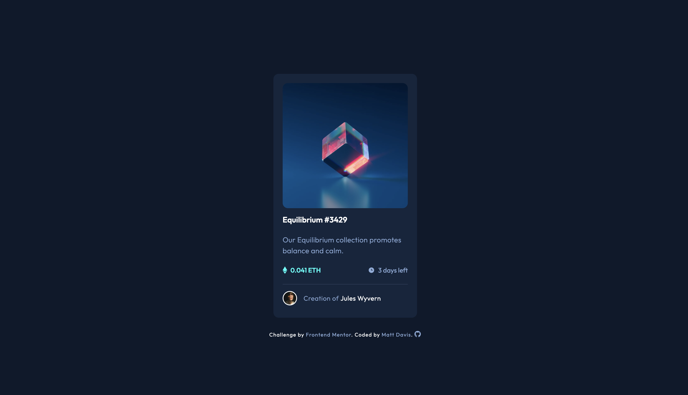

# 11 - Frontend Mentor - NFT Preview Card Component

This is a solution to the [NFT preview card component challenge on Frontend Mentor](https://www.frontendmentor.io/challenges/nft-preview-card-component-SbdUL_w0U). Frontend Mentor challenges help you improve your coding skills by building realistic projects.

### The challenge

Users should be able to:

- View the optimal layout depending on their device's screen size
- See hover states for interactive elements

### Screenshot of my solution

### Links

- GitHub URL: [11. nft-preview-card](https://github.com/mattdavis06/Frontend-Mentor-Projects/tree/main/11.%20nft-preview-card-component)
- Live Site URL: [//11-nft-preview-card-component.netlify.app/](https://11-nft-preview-card-component.netlify.app/)

### Built with

- Semantic HTML5 markup
- CSS custom properties
- Flexbox
- Mobile-first workflow
- Vanilla JavaScript
- Font Awesome

## Author

- Website - [mdavis.dev](https://www.mdavis.dev)
- Frontend Mentor - [@mattdavis06](https://www.frontendmentor.io/profile/mattdavis06)
