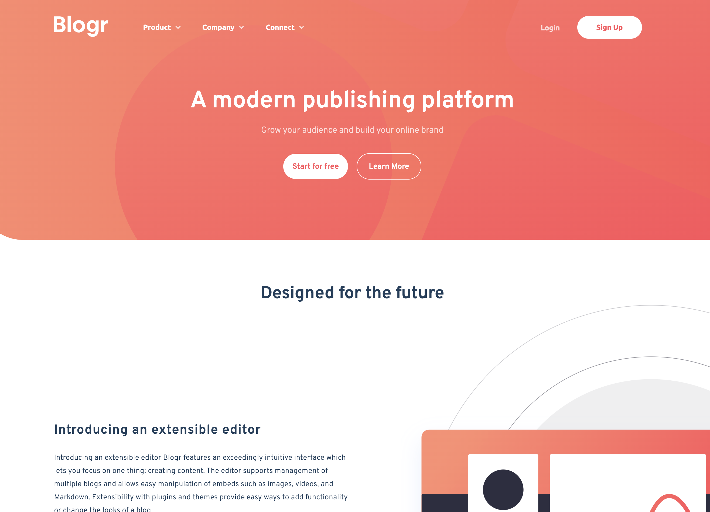

# 12 - Frontend Mentor - Blogr Landing Page

This is a solution to the [Blogr Page challenge on Frontend Mentor](https://www.frontendmentor.io/challenges/blogr-landing-page-EX2RLAApP). Frontend Mentor challenges help you improve your coding skills by building realistic projects.

### The challenge

Users should be able to:

- View the optimal layout depending on their device's screen size
- See hover states for interactive elements

### Screenshot of my solution

### Links

- GitHub URL: [12. blogr-landing-page](https://github.com/mattdavis06/Frontend-Mentor-Projects/tree/main/12.%20blogr-landing-page)
- Live Site URL: [//12-blogr-landing-page.netlify.app/](https://12-blogr-landing-page.netlify.app/)

### Built with

- Semantic HTML5 markup
- CSS custom properties
- Flexbox
- Mobile-first workflow
- Svelte
- Font Awesome

## Author

- Website - [mdavis.dev](https://www.mdavis.dev)
- Frontend Mentor - [@mattdavis06](https://www.frontendmentor.io/profile/mattdavis06)
