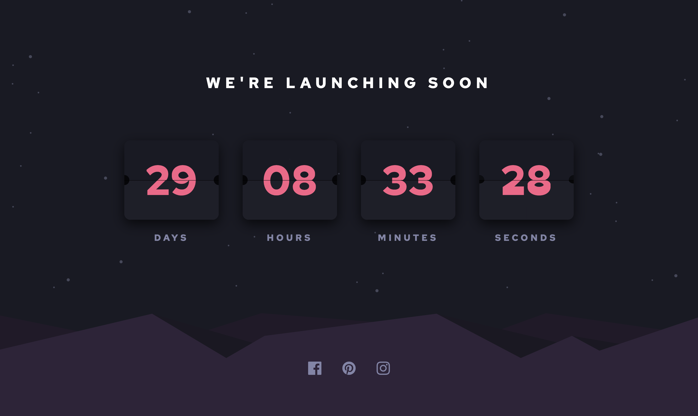

# 16 - Frontend Mentor - Launch Countdown Timer

This is a solution to the [Launch Countdown Timer challenge on Frontend Mentor](https://www.frontendmentor.io/challenges/launch-countdown-timer-N0XkGfyz-). Frontend Mentor challenges help you improve your coding skills by building realistic projects.

### The challenge

Users should be able to:

- See hover states for all interactive elements on the page
- See a live countdown timer that ticks down every second (start the count at 14 days)
- **Bonus**: When a number changes, make the card flip from the middle

### Screenshot

### Links

- Solution URL: [16. launch-countdown-timer](https://github.com/mattdavis06/Frontend-Mentor-Projects/tree/main/16.%20launch-countdown-timer)
- Live Site URL: [//16-launch-countdown-timer.netlify.app/](https://16-launch-countdown-timer.netlify.app/)

### Built with

- Semantic HTML5 markup
- CSS custom properties
- Flexbox
- Mobile-first workflow
- React

## Author

- Website - [mdavis.dev](https://www.mdavis.dev)
- Frontend Mentor - [@mattdavis06](https://www.frontendmentor.io/profile/mattdavis06)
