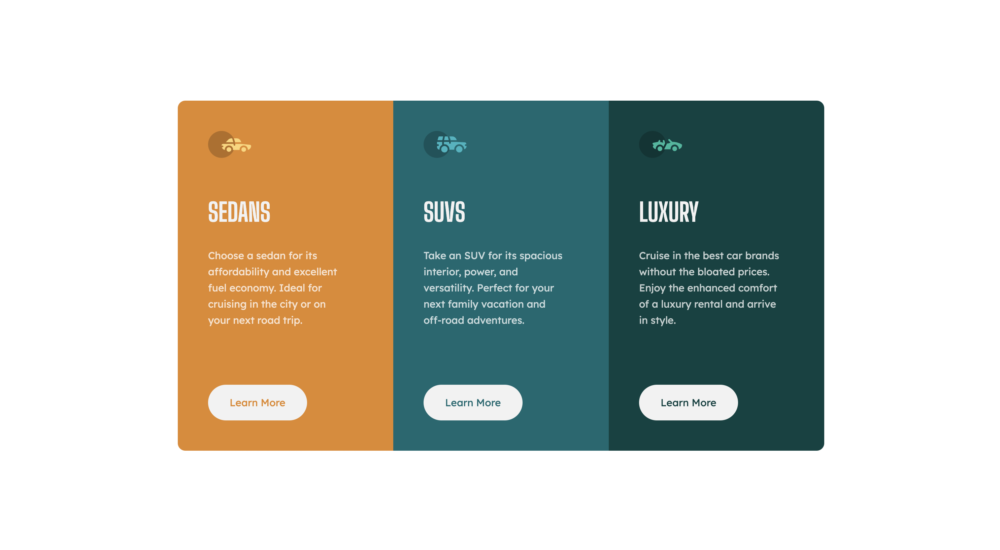

# 24 - Frontend Mentor - 3-column Preview Card Component

This is a solution to the [3-column preview card component challenge on Frontend Mentor](https://www.frontendmentor.io/challenges/3column-preview-card-component-pH92eAR2-). Frontend Mentor challenges help you improve your coding skills by building realistic projects.

### The challenge

Users should be able to:

- View the optimal layout depending on their device's screen size
- See hover and focus states for interactive elements

### Screenshot

### Links

- Solution URL: [24. 3-column preview card component](https://github.com/mattdavis06/Frontend-Mentor-Projects/tree/main/24.%203-column-preview-card-component)
- Live Site URL: [//24-3-column-preview-card-component.netlify.app/](https://24-3-column-preview-card-component.netlify.app/)

### Built with

- Semantic HTML5 markup
- CSS custom properties
- Flexbox
- Grid
- [React](https://reactjs.org/) - JS library
- Mobile-first workflow

## Author

- Website - [mdavis.dev](https://www.mdavis.dev)
- Frontend Mentor - [@mattdavis06](https://www.frontendmentor.io/profile/mattdavis06)
