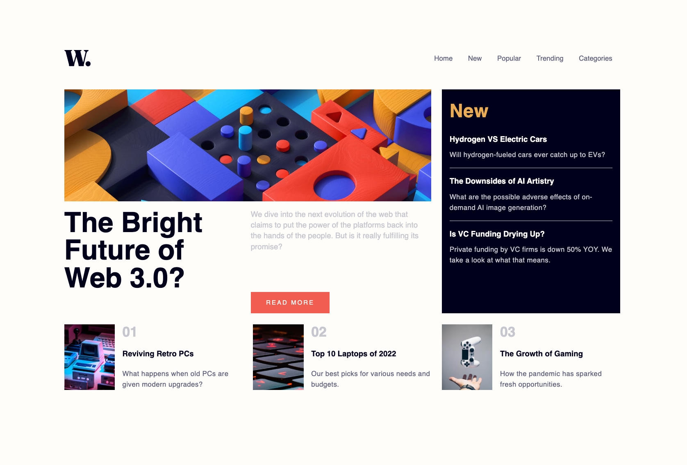

# 25 - Frontend Mentor - News Homepage

This is a solution to the [News homepage challenge on Frontend Mentor](https://www.frontendmentor.io/challenges/news-homepage-H6SWTa1MFl). Frontend Mentor challenges help you improve your coding skills by building realistic projects.

### The challenge

Users should be able to:

- View the optimal layout for the interface depending on their device's screen size
- See hover and focus states for all interactive elements on the page
- **Bonus**: Toggle the mobile menu (requires some JavaScript)

### Screenshot

### Links

- Solution URL: [25. News homepage](https://github.com/mattdavis06/Frontend-Mentor-Projects/tree/main/25.%203-news-homepage)
- Live Site URL: [//25-news-homepage.netlify.app/](https://25-news-homepage.netlify.app/)

### Built with

- Semantic HTML5 markup
- CSS custom properties
- Flexbox
- CSS Grid
- [TailwindCSS](https://tailwindcss.com/) - Utility-first CSS framework
- [React](https://reactjs.org/) - JS library
- Mobile-first workflow

## Author

- Website - [mdavis.dev](https://www.mdavis.dev)
- Frontend Mentor - [@mattdavis06](https://www.frontendmentor.io/profile/mattdavis06)
