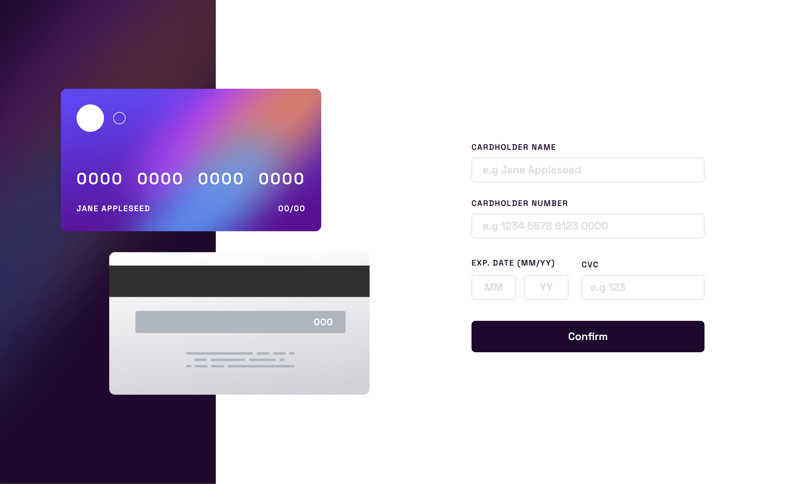

# 26 - Frontend Mentor - Interactive card details form solution

This is a solution to the [Interactive card details form challenge on Frontend Mentor](https://www.frontendmentor.io/challenges/interactive-card-details-form-XpS8cKZDWw). Frontend Mentor challenges help you improve your coding skills by building realistic projects.

### The challenge

Users should be able to:

- Fill in the form and see the card details update in real-time
- Receive error messages when the form is submitted if:
  - Any input field is empty
  - The card number, expiry date, or CVC fields are in the wrong format
- View the optimal layout depending on their device's screen size
- See hover, active, and focus states for interactive elements on the page

### Screenshot

### Links

- Solution URL: [26. Interactive card details form](https://github.com/mattdavis06/Frontend-Mentor-Projects/tree/main/26.%20interactive-card-details-form)
- Live Site URL: [//26-interactive-card-details-form.netlify.app/](https://26-interactive-card-details-form.netlify.app/)

### Built with

- Semantic HTML5 markup
- CSS custom properties
- Flexbox
- CSS Grid
- [TailwindCSS](https://tailwindcss.com/) - Utility-first CSS framework
- [React](https://reactjs.org/) - JS library
- Mobile-first workflow

## Author

- Website - [mdavis.dev](https://www.mdavis.dev)
- Frontend Mentor - [@mattdavis06](https://www.frontendmentor.io/profile/mattdavis06)
