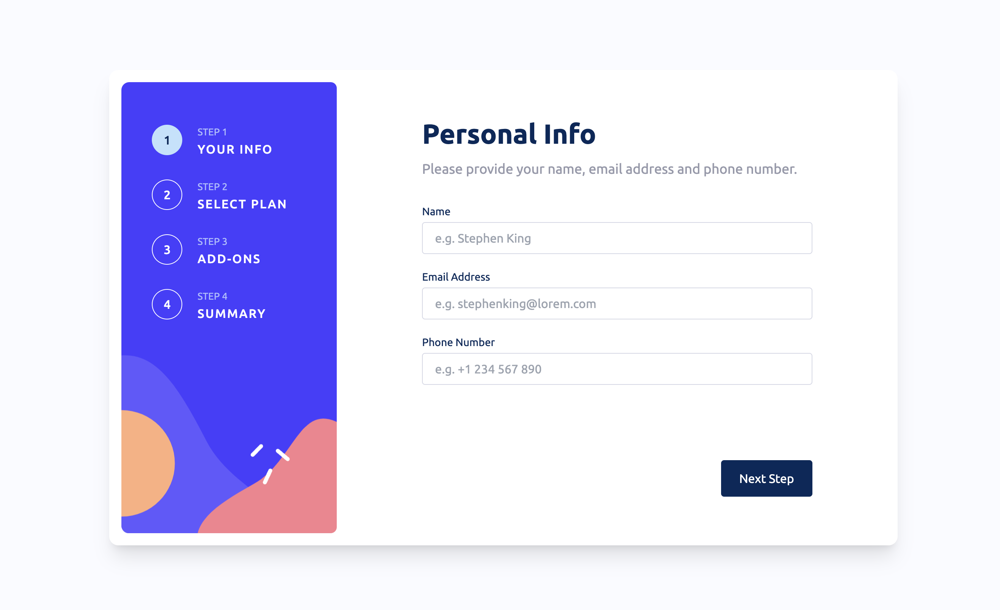

# 27 - Frontend Mentor - Multi-step form solution

This is a solution to the [Multi-step form challenge on Frontend Mentor](https://www.frontendmentor.io/challenges/multistep-form-YVAnSdqQBJ). Frontend Mentor challenges help you improve your coding skills by building realistic projects.

### The challenge

Users should be able to:

- Complete each step of the sequence
- See a summary of their selections on the final step and confirm their order
- View the optimal layout for the interface depending on their device's screen size
- See hover and focus states for all interactive elements on the page

### Screenshot

### Links

- Solution URL: [27. Multi-step form](https://github.com/mattdavis06/Frontend-Mentor-Projects/tree/main/27.%20multi-step-form-solution)
- Live Site URL: [//27-multi-step-form-solution.netlify.app/](https://27-multi-step-form-solution.netlify.app/)

### Built with

- Semantic HTML5 markup
- CSS custom properties
- Flexbox
- CSS Grid
- [TailwindCSS](https://tailwindcss.com/) - Utility-first CSS framework
- [React](https://reactjs.org/) - JS library
- [React Context](https://beta.reactjs.org/reference/react/useContext) - React Hook
- Mobile-first workflow

## Author

- Website - [mdavis.dev](https://www.mdavis.dev)
- Frontend Mentor - [@mattdavis06](https://www.frontendmentor.io/profile/mattdavis06)
