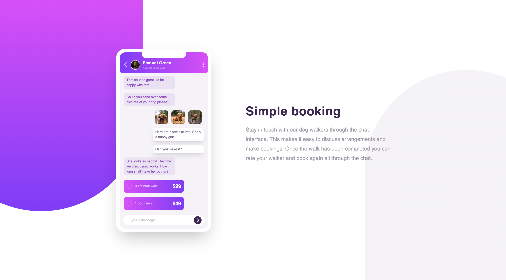

# 28 - Frontend Mentor - Chat App CSS Illustrator

This is a solution to the [Chat app CSS illustration challenge on Frontend Mentor](https://www.frontendmentor.io/challenges/chat-app-css-illustration-O5auMkFqY). Frontend Mentor challenges help you improve your coding skills by building realistic projects.

### The challenge

Users should be able to:

- View the optimal layout for the component depending on their device's screen size
- **Bonus**: See the chat interface animate on the initial load

### Screenshot

### Links

- Solution URL: [28. Chat App CSS](https://github.com/mattdavis06/Frontend-Mentor-Projects/tree/main/28.%20chat-app-css)
- Live Site URL: [//28-chat-app-css.netlify.app/](https://28-chat-app-css.netlify.app/)

### Built with

- Semantic HTML5 markup
- CSS custom properties
- Flexbox
- CSS Grid
- [TailwindCSS](https://tailwindcss.com/) - Utility-first CSS framework
- Mobile-first workflow

## Author

- Website - [mdavis.dev](https://www.mdavis.dev)
- Frontend Mentor - [@mattdavis06](https://www.frontendmentor.io/profile/mattdavis06)
