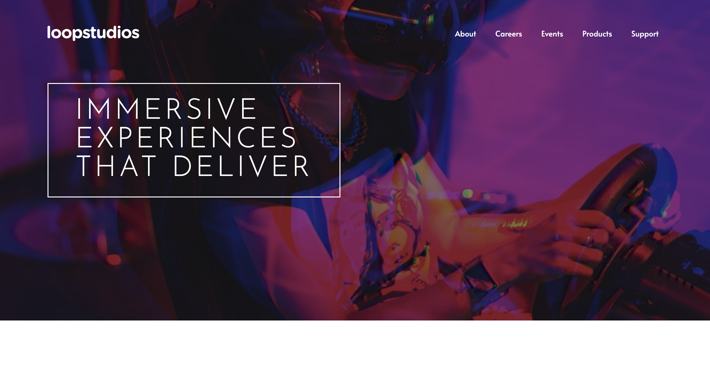

# 29 - Frontend Mentor - Loopstudios Landing Page

This is a solution to the [Loopstudios landing page challenge on Frontend Mentor](https://www.frontendmentor.io/challenges/loopstudios-landing-page-N88J5Onjw). Frontend Mentor challenges help you improve your coding skills by building realistic projects.

### The challenge

Users should be able to:

- View the optimal layout for the site depending on their device's screen size
- See hover states for all interactive elements on the page

### Screenshot

### Links

- Solution URL: [29. Loopstudios Landing Page](https://github.com/mattdavis06/Frontend-Mentor-Projects/tree/main/29.%20loopstudios-landing-page)
- Live Site URL: [//29-loopstudios-landing-page.netlify.app/](https://29-loopstudios-landing-page.netlify.app/)

### Built with

- Semantic HTML5 markup
- CSS custom properties
- Flexbox
- CSS Grid
- [React](https://reactjs.org/) - JS library
- [TailwindCSS](https://tailwindcss.com/) - Utility-first CSS framework
- Mobile-first workflow

## Author

- Website - [mdavis.dev](https://www.mdavis.dev)
- Frontend Mentor - [@mattdavis06](https://www.frontendmentor.io/profile/mattdavis06)
