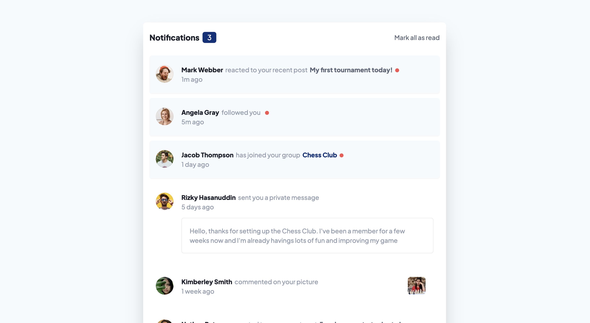

# 31 - Frontend Mentor - Notifications Page

This is a solution to the [Notifications page challenge on Frontend Mentor](https://www.frontendmentor.io/challenges/notifications-page-DqK5QAmKbC). Frontend Mentor challenges help you improve your coding skills by building realistic projects.

### The challenge

Users should be able to:

- Distinguish between "unread" and "read" notifications
- Select "Mark all as read" to toggle the visual state of the unread notifications and set the number of unread messages to zero
- View the optimal layout for the interface depending on their device's screen size
- See hover and focus states for all interactive elements on the page

### Screenshot

### Links

- Solution URL: [31. Notifications Page](https://github.com/mattdavis06/Frontend-Mentor-Projects/tree/main/31.%20notifications-page)
- Live Site URL: [//31-notifications-page.netlify.app/](https://31-notifications-page.netlify.app/)

### Built with

- Semantic HTML5 markup
- Flexbox
- CSS Grid
- [TailwindCSS](https://tailwindcss.com/) - Utility-first CSS framework
- [React](https://reactjs.org/) - JS library
- [TypeScript](https://www.typescriptlang.org/) - Superset of JavaScript
- [ViteJS](https://vitejs.dev/) - Next Generation Frontend Tooling
- Mobile-first workflow

## Author

- Website - [mdavis.dev](https://www.mdavis.dev)
- Frontend Mentor - [@mattdavis06](https://www.frontendmentor.io/profile/mattdavis06)
