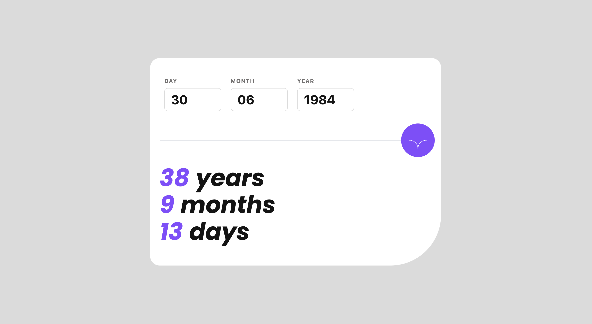

# 32 - Frontend Mentor - Age Calculator App

This is a solution to the [Age calculator app challenge on Frontend Mentor](https://www.frontendmentor.io/challenges/age-calculator-app-dF9DFFpj-Q). Frontend Mentor challenges help you improve your coding skills by building realistic projects.

### The challenge

Users should be able to:

- View an age in years, months, and days after submitting a valid date through the form
- Receive validation errors if:
  - Any field is empty when the form is submitted
  - The day number is not between 1-31
  - The month number is not between 1-12
  - The year is in the future
  - The date is invalid e.g. 31/04/1991 (there are 30 days in April)
- View the optimal layout for the interface depending on their device's screen size
- See hover and focus states for all interactive elements on the page
- **Bonus**: See the age numbers animate to their final number when the form is submitted

### Screenshot

### Links

- Solution URL: [32. Age Calculator App](https://github.com/mattdavis06/Frontend-Mentor-Projects/tree/main/32.%20age-calculator-app)
- Live Site URL: [//32-age-calculator-app.netlify.app/](https://32-age-calculator-app.netlify.app/)

### Built with

- Semantic HTML5 markup
- Flexbox
- CSS Grid
- [TailwindCSS](https://tailwindcss.com/) - Utility-first CSS framework
- [React](https://reactjs.org/) - JS library
- [TypeScript](https://www.typescriptlang.org/) - Superset of JavaScript
- [ViteJS](https://vitejs.dev/) - Next Generation Frontend Tooling
- [React Spring](https://www.react-spring.dev/) - React Animation Package
- Mobile-first workflow

## Author

- Website - [mdavis.dev](https://www.mdavis.dev)
- Frontend Mentor - [@mattdavis06](https://www.frontendmentor.io/profile/mattdavis06)
