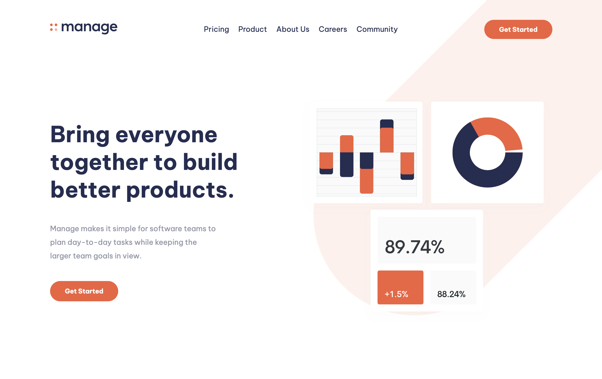

# 35 - Frontend Mentor - Manage Landing Page

This is a solution to the [Manage landing page challenge on Frontend Mentor](https://www.frontendmentor.io/challenges/manage-landing-page-SLXqC6P5). Frontend Mentor challenges help you improve your coding skills by building realistic projects.

### The challenge

Users should be able to:

- View the optimal layout for the site depending on their device's screen size
- See hover states for all interactive elements on the page
- See all testimonials in a horizontal slider
- Receive an error message when the newsletter sign up `form` is submitted if:
  - The `input` field is empty
  - The email address is not formatted correctly

### Screenshot

### Links

- Solution URL: [35. Manage Landing Page](https://github.com/mattdavis06/Frontend-Mentor-Projects/tree/main/35.%20manage-landing-page)
- Live Site URL: [//35-manage-landing-page.netlify.app/](https://35-manage-landing-page.netlify.app/)

### Built with

- Semantic HTML5 markup
- Flexbox
- CSS Grid
- [TailwindCSS](https://tailwindcss.com/) - Utility-first CSS framework
- [React](https://reactjs.org/) - JS library
- [TypeScript](https://www.typescriptlang.org/) - Superset of JavaScript
- [React Slick Carousel](https://www.npmjs.com/package/react-slick) - Packge for Slick Carousel
- [ViteJS](https://vitejs.dev/) - Next Generation Frontend Tooling
- [Hygraph](https://hygraph.com/) - Headless CMS
- Mobile-first workflow

## Author

- Website - [mdavis.dev](https://www.mdavis.dev)
- Frontend Mentor - [@mattdavis06](https://www.frontendmentor.io/profile/mattdavis06)
